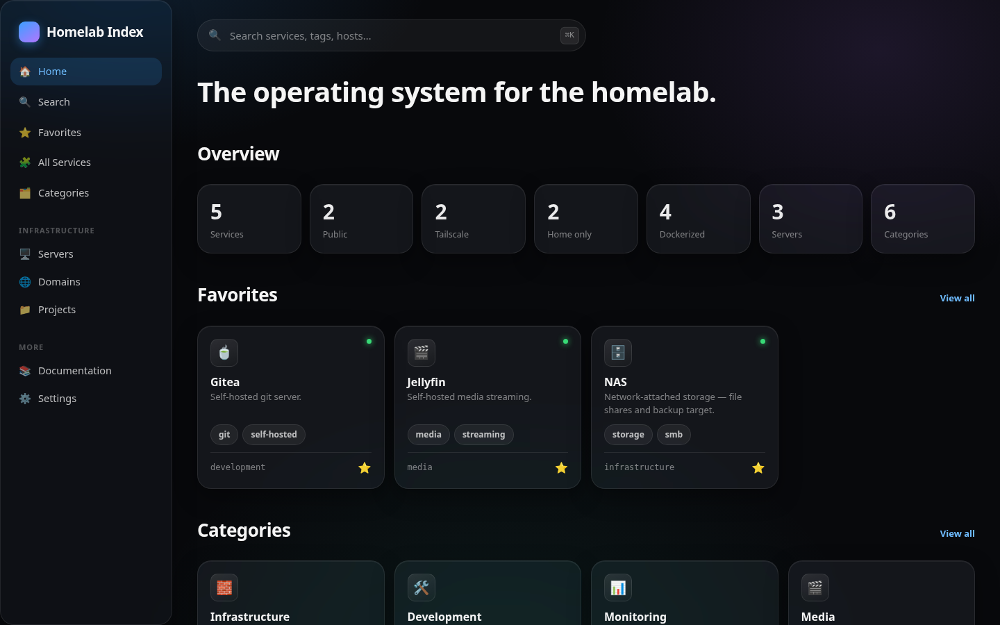

# Homelab Index

A self-hosted homelab portal that's the single source of truth for your
infrastructure — every service, server, domain, and project, in one
searchable, beautiful, fast interface. Backed by plain YAML files. No
database, no build step, no JS framework.

This is not a bookmarks page. It's meant to be the place where "where does
X run, what's the container name, is it public" always has an answer — for
you, and for an AI agent (Claude Code or otherwise) helping you maintain it.



## Highlights

- **Zero duplicated information** — servers, domains, and projects aren't
  separate files, they're derived from fields already on each service.
- **AI-editable by design** — everything is YAML on disk; there's also a
  full JSON CRUD API under `/api`, meant as the foundation for future MCP
  tools.
- **No hardcoded services** — the entire UI generates itself from
  `data/`. Add a category, add a service, refresh the page.
- **iOS-inspired dark UI** — frosted glass, large typography, instant
  HTMX-powered search, keyboard shortcuts (`⌘K` / `/`).
- **No auth of its own** — designed to sit behind Cloudflare Access (or a
  VPN, or nothing, on a trusted LAN). One less thing to maintain.

## Quick start

```bash
git clone https://github.com/Raylu42x/homelab-index.git
cd homelab-index
docker compose up -d
```

Visit `http://localhost:8000`. The repo ships with a handful of example
services (NAS, Jellyfin, Gitea, Crafty) so there's something to look at —
delete them and add your own.

## Documentation

- [Installation](docs/installation.md)
- [Docker deployment](docs/docker-deployment.md) (incl. Cloudflare Access)
- [Updating](docs/updating.md)
- [Data model](docs/data-model.md) (folder structure, YAML schema, editing)
- [Backup & restore](docs/backup-restore.md)

## Stack

FastAPI + Jinja2 + HTMX + vanilla CSS/JS on the frontend. No React, no
build pipeline, minimal dependencies, small Docker image, low RAM/CPU.

## Future integrations

The data model and `/api` layer are built so these stay simple additions,
not architecture changes: Uptime Kuma (status polling), Docker Engine API
(auto-populate container names), GitHub API, Cloudflare API, Tailscale API,
Home Assistant, Ollama/local LLMs, Grafana, Prometheus.

## License

MIT — see [LICENSE](LICENSE).
